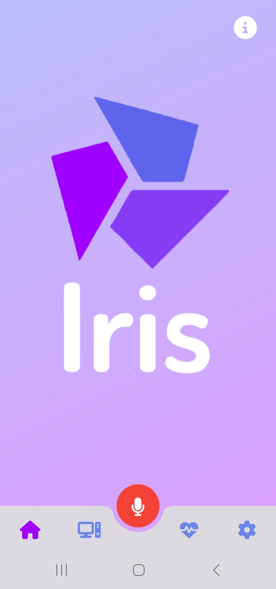
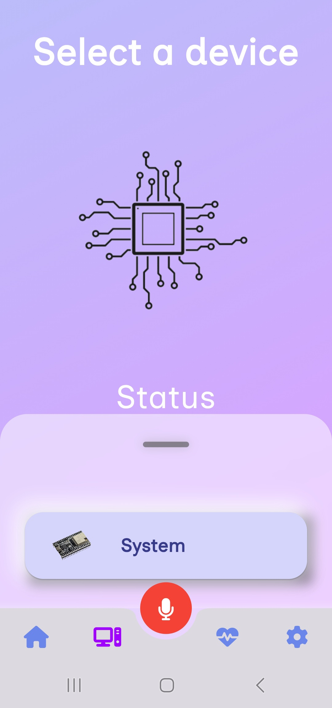
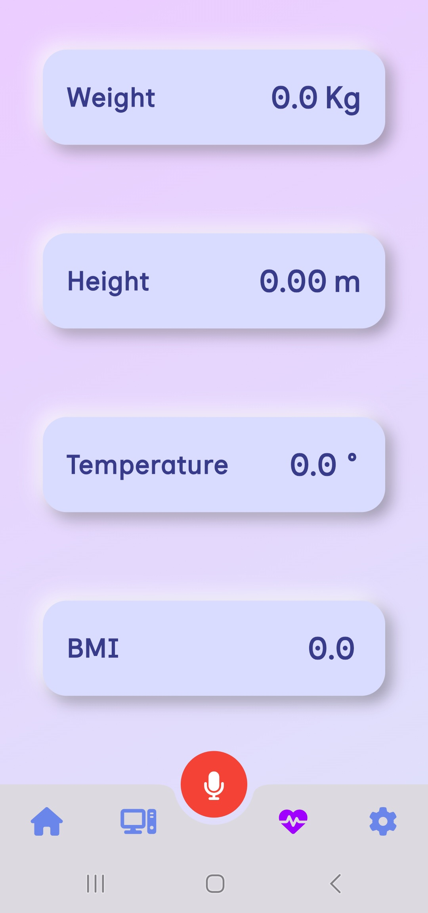
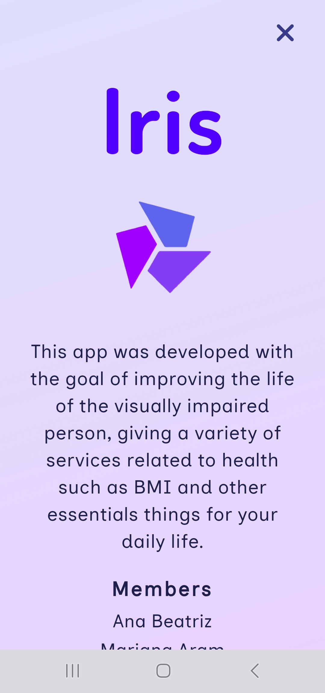
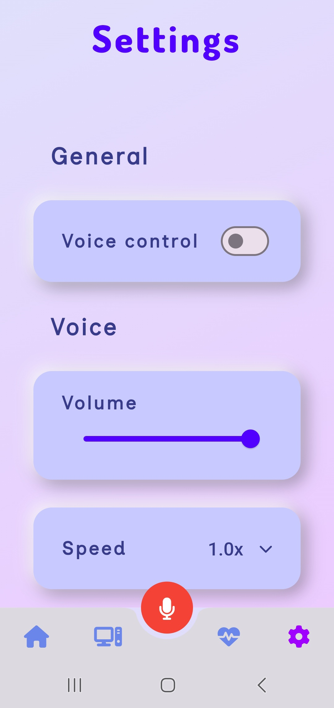
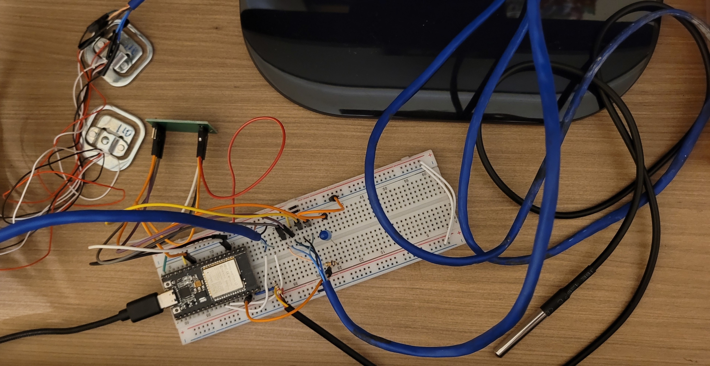
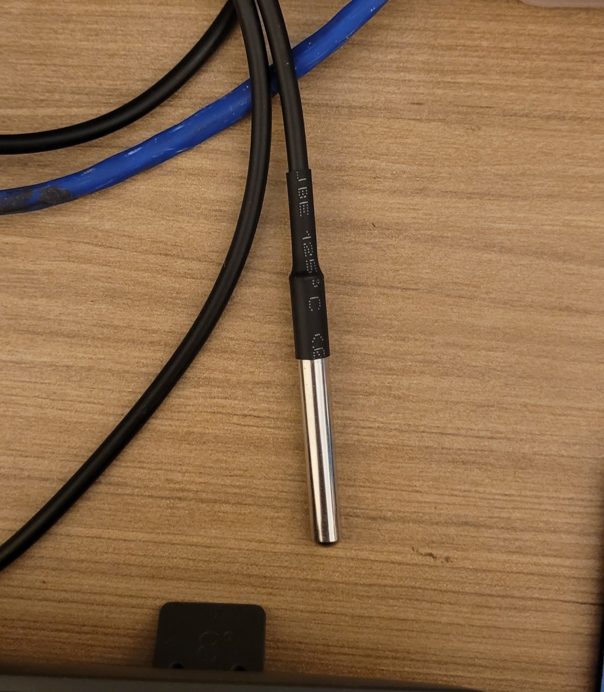
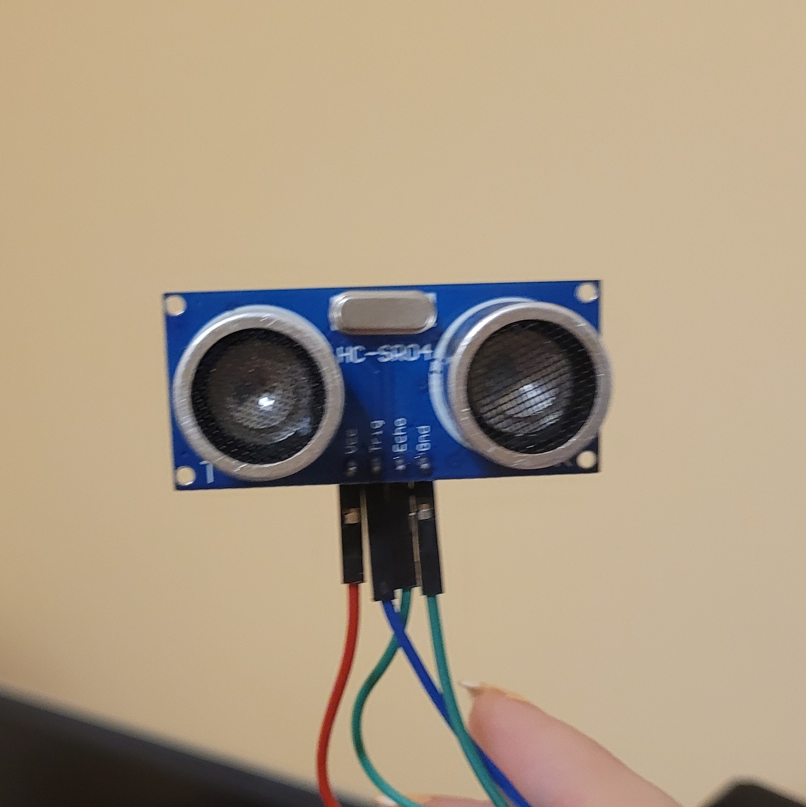

## Sumário

- [Sobre o projeto](#sobre-o-projeto)
- [Imagens do projeto](#imagens-do-projeto)
- [Modo desenvolvedor](#modo-desenvolvedor)
- [Créditos](#créditos)

## Sobre o projeto

### Objetivo

Irisé trabalho acadêmico da matéria de Laboratório de Desenvolvimento para Dispositivos Móveis do curso de graduação de Engenharia de ComputaçãO, que concorreu ao concurso Imagine Cup 2024, ela é um aplicativo mobile para ajudar deficientes visuais a controlar saúde.

Iris funciona a partir de um sistema de áudio que possibilita o controle da saúde de pessoas com deficiência visual através de hardwares que geram dados sobre altura, peso e temperatura do usuário.

### Público-alvo

Pessoas com deficiência visual.

### Funcionalidades

- Conectar com hardwares;
- Gerar novos dados a partir de dados obtidos (como IMC);
- Comunicar todos os dados obtidos e gerado através de áudio.

## Imagens do projeto

### Intefaces







### Hardware





### Fluxograma do programa


## Instalação

Para instalar o aplicativo em seu celular, abra o link e baixe o arquivo apk

- [Link para o arquivo apk](https://drive.google.com/file/d/1NWOhdup8y5AraOV6iu96ClMejNaK75El/view)

Depois que baixar, intale o aplicativo, lembre-se de selecionar a opção `baixar mesmo assim` apos o aviso de segurança

> O aplicativo está diponível somente para android

## Modo desenvolvedor

### 1. Configuração do ambiente

Instale o Framework Flutter em seu computador e os ambientes de desvolvedor com os links a seguir:

- [Flutter](https://docs.flutter.dev/get-started/install)
- [VS Code](https://code.visualstudio.com/download)
- [Git](https://git-scm.com/)

### 2. Clonar o projeto

Coloque os seguintes comando em seu git bash para obter o projeto em seu computador

```
git clone https://github.com/paulatalim/Iris.git
```
```
cd iris
```

### 3. Executar projeto

Para executar o projeto siga as instruções:

**a. Insira no terminal os seguintes comandos**

```
flutter clean
```

```
flutter pub get
```

**b. Ative o emulador android em seu computador**

**c. Execute o código no VS Code**

## Créditos

### Integrantes do grupo

- [Ana Beatriz](https://github.com/Ana-Bea-S)
- [Mariana Aram](https://www.linkedin.com/in/mariana-aram-silva-a766b623b/)
- [Paula Talim](https://www.linkedin.com/in/paulatalim/)
- [Pedro Mafra](https://www.linkedin.com/in/pedro-mafra-vas/)

### Professor orientador

- [Ilo Riveiro](https://www.linkedin.com/in/ilorivero/)

